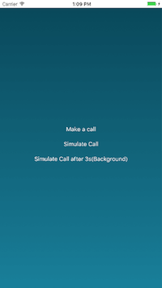
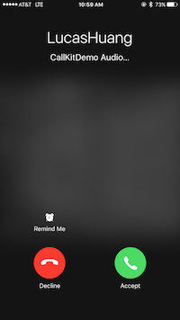
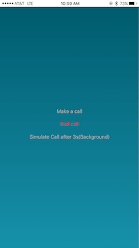
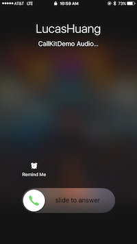
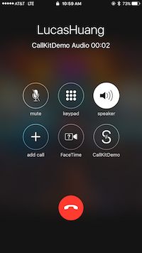
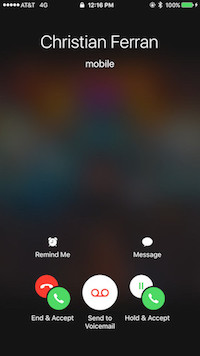

## CallKit Integration with OpenTok
A sample app to demonstrate how to integrate the [CallKit](https://developer.apple.com/documentation/callkit) into OpenTok iOS SDK. This sample app is built based on the [SpeakerBox](https://developer.apple.com/library/content/samplecode/Speakerbox/Introduction/Intro.html) app from [WWDC 2016 CallKit Session](https://developer.apple.com/videos/play/wwdc2016/230/)

### Install the project files

Use CocoaPods to install the project files and dependencies.

1. Install CocoaPods as described in [CocoaPods Getting Started](https://guides.cocoapods.org/using/getting-started.html#getting-started).
1. In Terminal, `cd` to your project directory and type `pod install`. (Sometimes, `pod update` is magical)
1. Reopen your project in Xcode using the new `*.xcworkspace` file.

### Configure and build the app

Configure the sample app code. Then, build and run the app.

1. The application **requires** values for **API Key**, **Session ID**, and **Token**. In the sample, you can get these values at the [OpenTok Developer Dashboard](https://dashboard.tokbox.com/). For production deployment, you must generate the **Session ID** and **Token** values using one of the [OpenTok Server SDKs](https://tokbox.com/developer/sdks/server/).

1. Replace the following empty strings with the corresponding **API Key**, **Session ID**, and **Token** values in `AppDelegate.swift`:
    ```swift
      let apiKey = ""
      let sessionId = ""
      let token = ""
    ```

1. Use Xcode to build and run the app on an iOS simulator or device.

### Exploring the sample app



  1. **Make a call**: 

The iOS system boosts the call priority of the app. Then, the app starts publishing to OpenTok platform. You won't notice any differences until you go to the home screen. Two ways to verify:
  - A badge in home screen indicating an ongoing VoIP call.
  - An incoming native phone call will not interrupt the current VoIP call, instead it shows the option menu.
  
  ***You will need a device to test the followings***

  2. **Simulate an incoming call**

The native incoming call screen appears. Upon acceptance, the iOS system opens the app and boosts the call priority. Then, the app starts publishing to OpenTok platform.

 ---> 

  3. **Simulate an incoming call after 3s(Background)** (After clicking the button, please lock your cell phone to test this scenario.)

The system wakes up your cell phone by making a native calling screen appear. Upon acceptance (a slider is shown instead of two buttons for the locked screen), the phone stays locked and boosts the call priority. Then, the app (which runs in the background during that time) starts publishing to OpenTok platform. 

 ---> 

  4. **Without simulation, use a push server or [NWPusher](https://github.com/noodlewerk/NWPusher) to call**

This requires a few more steps to test:

    - create your certificate
    - configure your push notification backend or NWPusher
    - locate your device token for testing (launch the app and get it from the console)
    - send a remote notification from your backend or NWPusher


**Notice**: You might want to use [OpenTok.js Sample App](https://github.com/opentok/opentok-web-samples/tree/master/Basic%20Video%20Chat) to test the sample app together.

### Exploring the codes

A `CXProvider` object is responsible for reporting out-of-band notifications that occur to the system. To create one, you first need to initialize a `CXProviderConfiguration` object, which encapsulates the behaviors and capabilities of calls, to pass on to the `CXProvider` initializer. In order to receive telephony events of the provider, the provider needs to specify an object conforming to the `CXProviderDelegate` protocol.

```swift
// create a provider configuration
let localizedName = NSLocalizedString("CallKitDemo", comment: "Name of application")
let providerConfiguration = CXProviderConfiguration(localizedName: localizedName)
providerConfiguration.supportsVideo = false
providerConfiguration.maximumCallsPerCallGroup = 1
providerConfiguration.supportedHandleTypes = [.phoneNumber]
providerConfiguration.iconTemplateImageData = UIImagePNGRepresentation(#imageLiteral(resourceName: "IconMask"))
providerConfiguration.ringtoneSound = "Ringtone.caf"

// set up a provider
provider = CXProvider(configuration: providerConfiguration)
provider.setDelegate(self, queue: nil)
```

The `CXProviderDelegate` protocol defines events of the telephony provider (`CXProvider`) such as the call starting, the call being put on hold, or the provider’s audio session is activated.

```swift
// MARK: CXProviderDelegate
func providerDidReset(_ provider: CXProvider) {
    print("Provider did reset")
}

func provider(_ provider: CXProvider, perform action: CXStartCallAction) {
    print("Provider performs the start call action")

    /*
      Configure the audio session, but do not start call audio here, since it must be done once
      the audio session has been activated by the system after having its priority elevated.
    */
}

func provider(_ provider: CXProvider, perform action: CXAnswerCallAction) {
    print("Provider performs the answer call action")

    /*
      Configure the audio session, but do not start call audio here, since it must be done once
      the audio session has been activated by the system after having its priority elevated.
    */
}

func provider(_ provider: CXProvider, perform action: CXEndCallAction) {
    print("Provider performs the end call action")

    // Trigger the call to be ended via the underlying network service.
}

func provider(_ provider: CXProvider, perform action: CXSetHeldCallAction) {
    print("Provider performs the hold call action")
}

func provider(_ provider: CXProvider, perform action: CXSetMutedCallAction) {
    print("Provider performs the mute call action")
}
``` 

The following methods indicate whether your VoIP call has been successfully priority boosted or recovered.

```swift
func provider(_ provider: CXProvider, timedOutPerforming action: CXAction) {
    print("Timed out \(#function)")
    // React to the action timeout if necessary, such as showing an error UI.
}

func provider(_ provider: CXProvider, didActivate audioSession: AVAudioSession) {
    // Start call audio media, now that the audio session has been activated after having its priority boosted.
}

func provider(_ provider: CXProvider, didDeactivate audioSession: AVAudioSession) {
    /*
        Restart any non-call related audio now that the app's audio session has been
        de-activated after having its priority restored to normal.
    */
}
```

Let's explore how to make a call and answer a call on behalf of a user. To do that, we need a `CXCallController` object to interact with the system. 

The `CXCallController` object takes a `CXTransaction` object to request a telephony action (which will later trigger delegate methods above if succeed). To specify a telephony action in a transaction, you need to create your desired action object and associate them with the transaction. Each telephony action has a corresponding `CXAction` class such as `CXEndCallAction` for ending a call, `CXSetHeldCallAction` for setting a call on hold. 

Once you have it all ready, invoke the `request(_:completion:)` by passing a ready transaction object. Here's how you start a call:

```swift
// create a CXAction
let startCallAction = CXStartCallAction(call: UUID(), handle: CXHandle(type: .phoneNumber, value: handle))

// create a transaction
let transaction = CXTransaction()
transaction.addAction(startCallAction)

// create a label
let action = "startCall"

callController.request(transaction) { error in
    if let error = error {
        print("Error requesting transaction: \(error)")
    } else {
        print("Requested transaction \(action) successfully")
    }
}
```

As for answering a call, the `CallKit` framework provides a convenient API to present a native calling UI like the screen-shot below. By invoking `reportNewIncomingCall(with:update:completion:)` on the provider, you will have the same experience as receiving a native phone call. Often, this piece of code works with VoIP remote notification to make calls to a device/person like WhatsApp, WeChat, and Messenger etc.

```swift
// Construct a CXCallUpdate describing the incoming call, including the caller.
let update = CXCallUpdate()
update.remoteHandle = CXHandle(type: .phoneNumber, value: handle)

// Report the incoming call to the system
provider.reportNewIncomingCall(with: uuid, update: update) { error in
    /*
      Only add incoming call to the app's list of calls if the call was allowed (i.e. there was no error)
      since calls may be "denied" for various legitimate reasons. See CXErrorCodeIncomingCallError.
    */
}
```




### A glitch

There is a small [issue](https://forums.developer.apple.com/thread/64544) when accepting a call from a locked screen. The underlying audio session does not get activated propertly inside the CallKit framework. Apple's engineers propose a workaround by setting up the audio session as early as possible to make the case work out temporarily: 

```
then a workaround would be to configure your app's audio session (call `configureAudioSession()`) earlier in your app's lifecycle, before the `-provider:performAnswerCallAction:` method is invoked.
```
