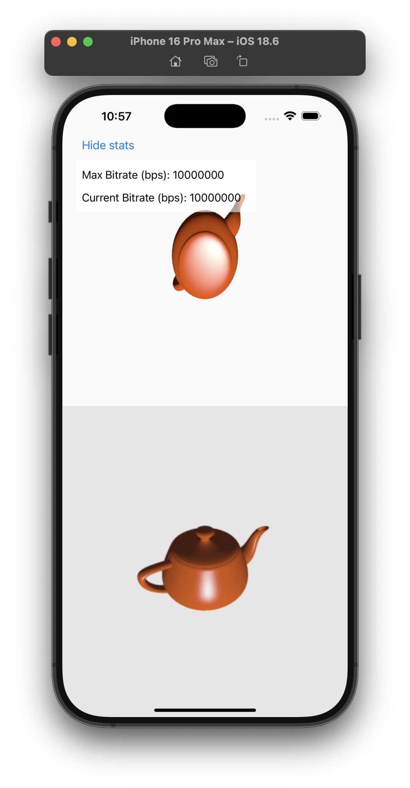

Sender Stats Sample App
========================================

This sample app demonstrates how to get and show sender stats to the user. It shows how to get the `OTSenderStats` object that contains information such as maxBitrate and currentBitrate in bps. More information on sender stats can be read [here](https://tokbox.com/developer/guides/sender-stats).

*Important:* To use this application, follow the instructions in the
[Quick Start](../README.md#quick-start) section of the main README file
for this repository.



## Setting up the statistis

The following steps are needed to implement the stats monitoring. These are also highlighted in the code sample within `ChatViewController`, along with specific usage example. 

### Step 1

First, you need to set the `senderStatisticsTrack` of the Publisher to `true` to start sending the statistics.

### Step 2

Next it is important to set the `subscriber.networkStatsDelegate` on the subscriber - to start getting the delegate callbacks, that contain the statistics.

### Step 3

Add conformance to the `OTSubscriberKitNetworkStatsDelegate` protocol, to be able to read `OTSenderStats`, when the callbacks get triggered.

```swift
    func subscriber(_ subscriber: OTSubscriberKit, videoNetworkStatsUpdated stats: OTSubscriberKitVideoNetworkStats) {
        // here you can use stats.senderStats - which gives the access to the `OTSenderStats`.
    }
```
### Final 

Now we have the stats - however to see the proper values for currentBitrate, we'll need to make a connection. To do that, simply join the same session with 2 clients (could be a web client + iOS device, or just 2 separate iOS simulators running simultaneously). When a publisher and subscriber are connected within one session, then we should see the actual bitrates within the sender stats property.


